# RPi LED Panels

A C++ application for driving and animating RGB LED matrix panels on a Raspberry Pi. 

This project utilizes the [rpi-rgb-led-matrix](https://github.com/hzeller/rpi-rgb-led-matrix) library to control the hardware and features a built-in REST API powered by the [Oat++](https://oatpp.io/) web framework. The API allows to remotely switch animations, tweak animation parameters, adjust brightness, etc.

## Features

- **Hardware control:** Native RGB LED matrix rendering on Raspberry Pi.
- **REST API:** Control the panels remotely via HTTP (e.g., change animations, get/set parameters, toggle power, set brightness).
- **Animations:** Generative animations including Game of Life, Heightmap, Matrix digital rain, Particles, Lightning, Stars, and more. (examples in the [Animations](#animations) section below)
- **Procedural generation:** uses [FastNoise2](https://github.com/Auburn/FastNoise2) for noise-based effects.
- **Media support:** Displays images using `stb_image` and dynamically generates QR codes using `qrcodegen`.

## Animations

<table>
  <tr>
    <td align="center"><b>Game of Life</b></td>
    <td align="center"><b>Heightmap</b></td>
  </tr>
  <tr>
    <td>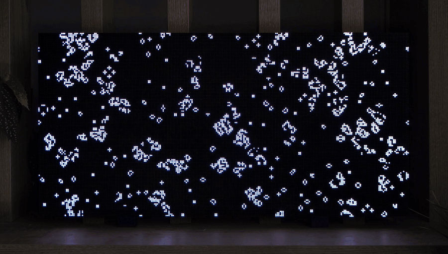</td>
    <td>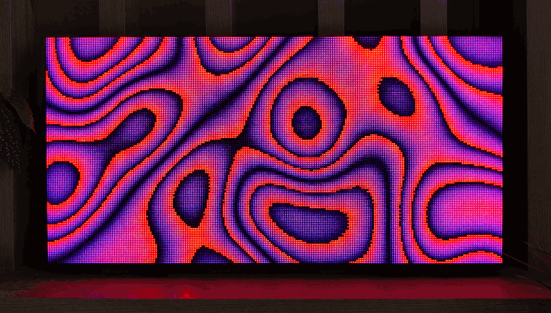</td>
  </tr>
  <tr>
    <td align="center"><b>Matrix</b></td>
    <td align="center"><b>Heightmap</b> (variation)</td>
  </tr>
  <tr>
    <td>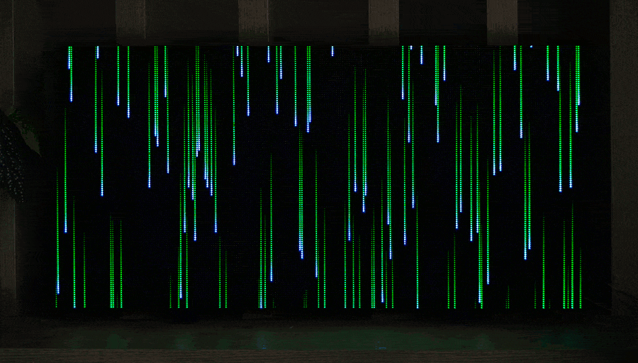</td>
    <td>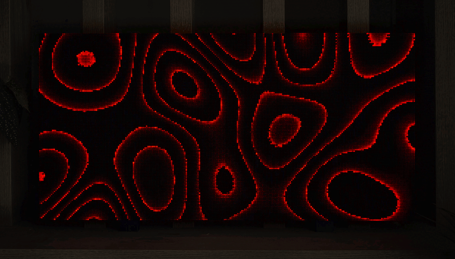</td>
  </tr>
  <tr>
    <td align="center"><b>Waves</b></td>
    <td align="center"><b>Stars</b></td>
  </tr>
  <tr>
    <td>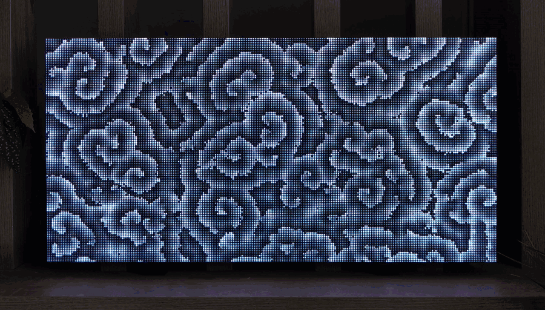</td>
    <td>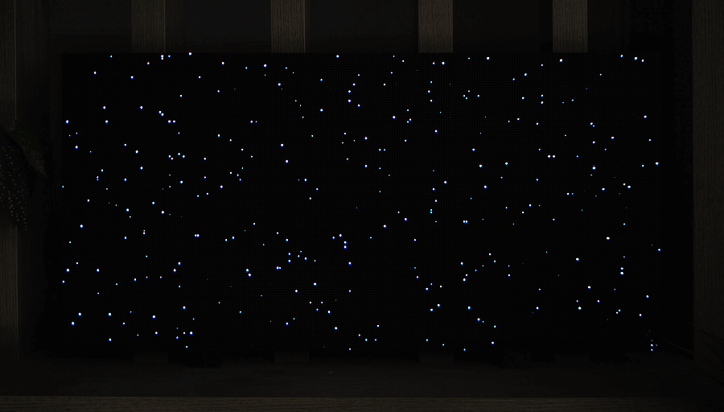</td>
  </tr>
  <tr>
    <td align="center"><b>Waves</b> (variation)</td>
    <td align="center"><b>Spotify</b></td>
  </tr>
  <tr>
    <td>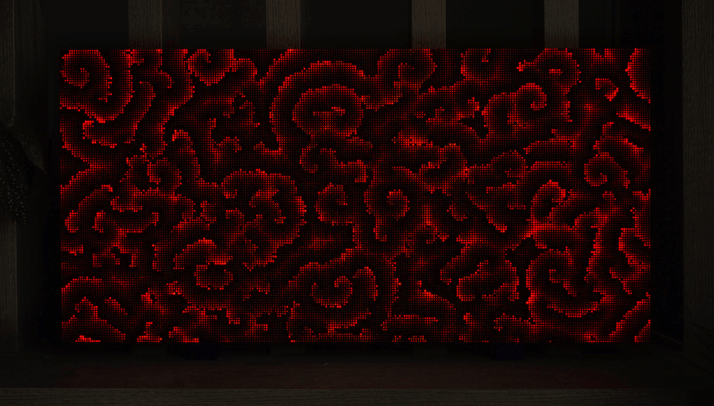</td>
    <td>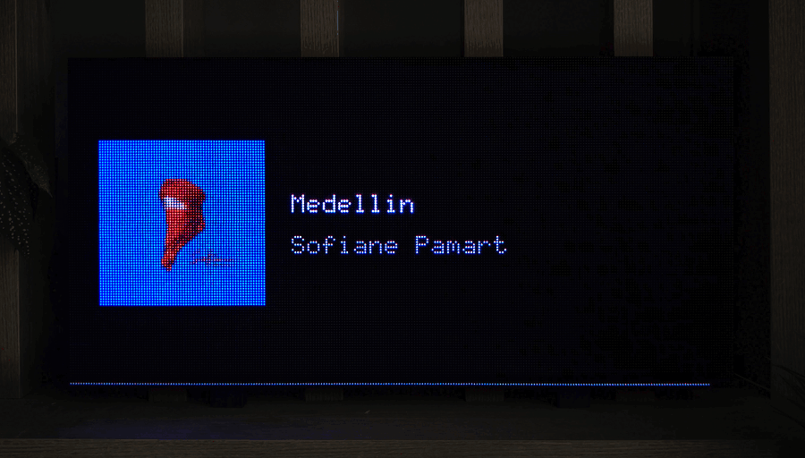</td>
  </tr>
  <tr>
    <td align="center"><b>Glyphs</b></td>
    <td align="center"><b>Particles</b></td>
  </tr>
  <tr>
    <td>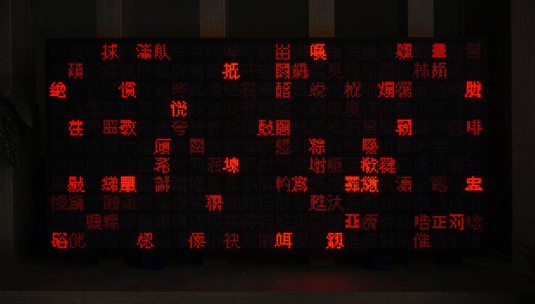</td>
    <td>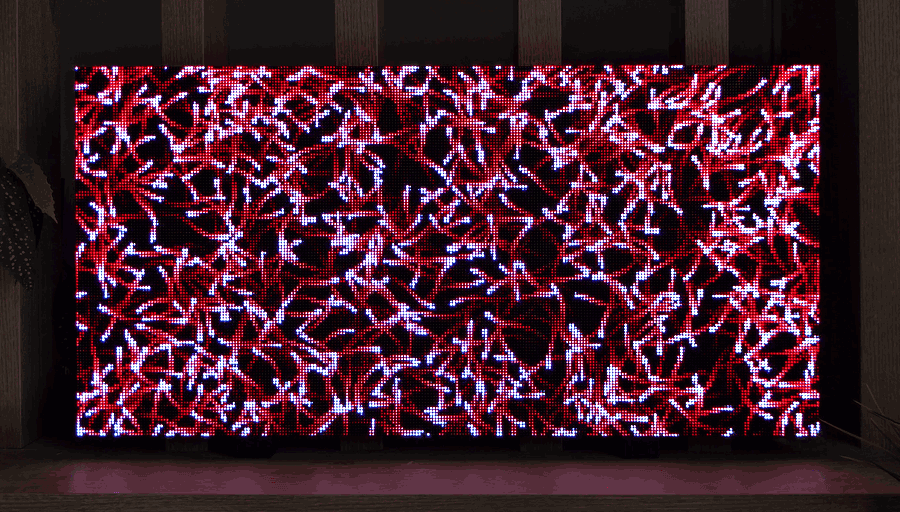</td>
  </tr>
  <tr>
    <td colspan="2" align="center">Bird flock simulation, maze generation &amp; more</td>
  </tr>
  <tr>
    <td>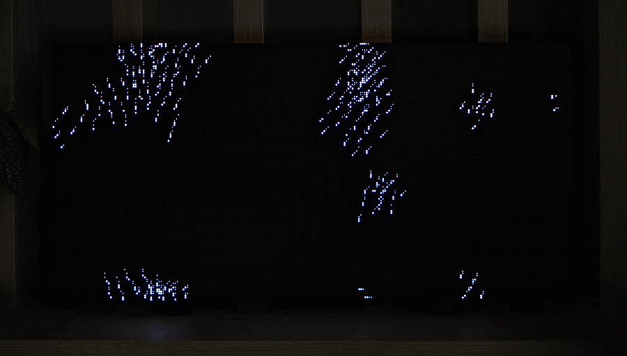</td>
    <td>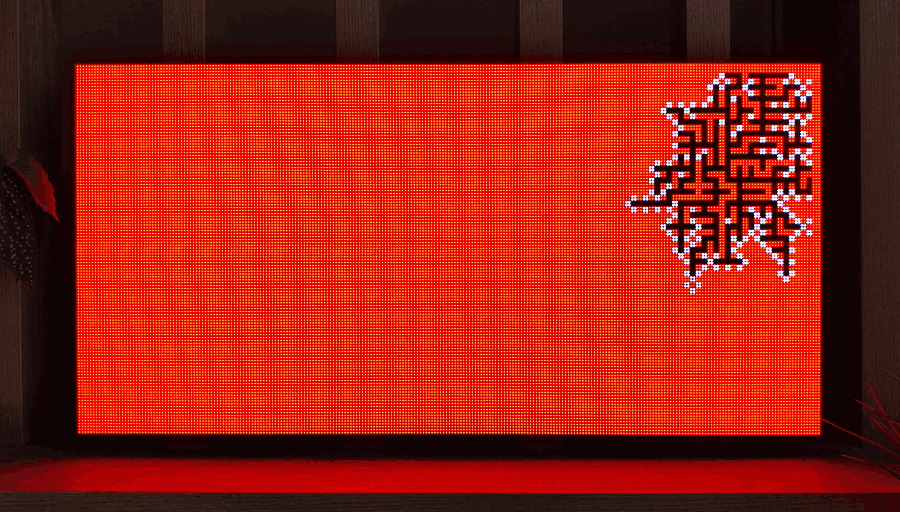</td>
  </tr>
</table>

## Dependencies

The project manages most of its dependencies via Git submodules and CMake. The following dependencies are required to be installed on the system:
- A C++17 compatible compiler (e.g., GCC or Clang)
- CMake (3.16 or newer)
- `libcurl` (e.g., `sudo apt install libcurl4-openssl-dev`)

## Building

```bash
git clone --recursive <repository-url>
cd rpi-led-panels
```

If already cloned without submodules, run:
```bash
git submodule update --init --recursive
```

Then, build the project using CMake:

```bash
mkdir build
cd build
cmake ..
make -j$(nproc)
```

## Usage

Run the executable as `root` because the `rpi-rgb-led-matrix` library requires direct access to the Raspberry Pi GPIO hardware.

```bash
./rpi-led-panels
```

Once running, the server exposes the REST API. You can check the available endpoints by looking at `MainController.hpp`, such as:
- `GET /animations` - List all available animations
- `POST /animation/{id}` - Set the current animation
- `POST /brightness/{value}` - Change the panel brightness
- `POST /state/{1|0}` - Turn the display on or off

## License
See the [LICENSE](LICENSE) file for more information.

